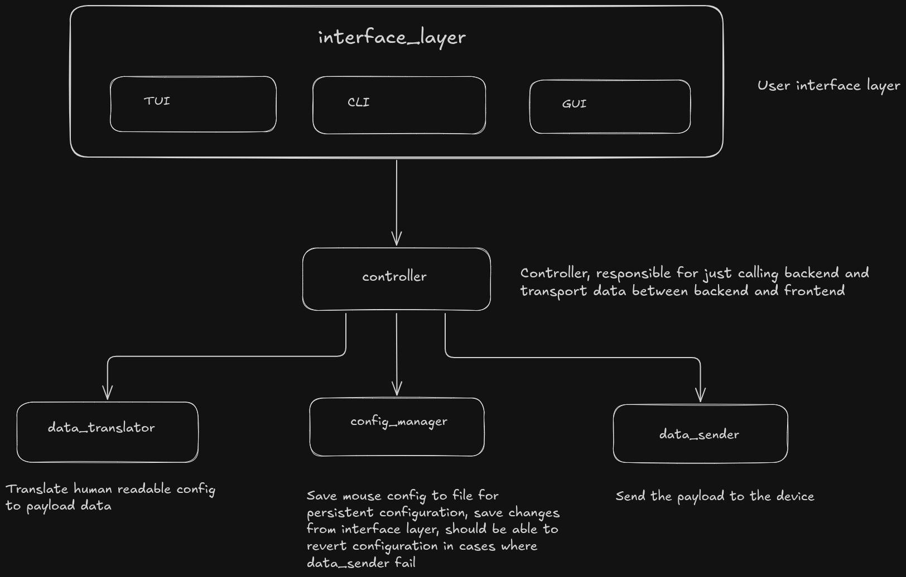

# ARCHITECTURE

[Schematic](https://excalidraw.com/#json=S0TxFzFO0XDhN04ja9Aqf,g_B23nqwXdD4L6Gtzmd5lw) on how the project will be structured:



Below is the file structure of the project:

```bash
Cargo.toml
.gitignore
README.md
config.default.toml
core/
    Cargo.toml
    src/
        lib.rs
        controller.rs # Integration between UI and backend
            run(config_path)
        data_translator.rs # Translation from human readable data to payload for data_sender
            translate(config)
        config_manager.rs # Responsible for collecting data defined in the config
            init_config(path)
            read_config(path)
            save_config(path, config)
            revert_config()
        data_sender.rs # Send the payload to the peripheral
            send_payload(payload)

# Below here need more work and thinking...
cli/
    Cargo.toml
    src/
        main.rs
tui/
    Cargo.toml
    src/
        main.rs
gui/
    Cargo.toml
    src/
        main.rs
```
